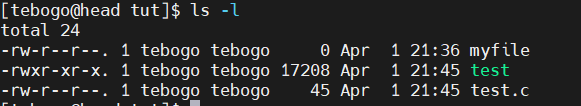

# Tutorial 2

## 1. Basic Linux Commands

The following Linux commands will help you navigate the Linux ecosystem and manage files and directories efficiently.

### 1.1 Navigating the file system

|   Command |   description |   example |
|   ------- |   ----------- |   ------- |
| `ls -a`   |list the contents of a directory/folder | `ls -a` |
| `pwd`     |print the current directory to the screen | `pwd`|
| `mkdir <directory_name>`   |create a new directory| `mkdir myfolder`|
| `cd <directory_name>` | change your directory (note ./ represents the current directory and ../ represents the directory above the current directory)| `cd myfolder`|
| `touch <file_name>`|create a new file| `touch myfile` |
| `cp <source> <destination>`| copy a file | `cp myfile ../` | 
| `mv <source> <destination>`| move a file | `mv myfile $HOME` |
| `echo <variable>`       | print to the screen |  `echo "hello world"` 
| `echo <variable> >> <file>`| print to some file. note ( ">>" appends and ">" deletes file contents and Writes to the file) | `echo "helloW0rld2" >> myfile`
| `cat <file>`| "print the content of a file to the screen" | `cat myfile` |
| `cat <source file> >>  <des file>`| "print the content of a file to some file"| `cat myfile >>  newfile` |

### 1.2  File and Directory Permissions

In Linux, file permissions determine who can read, write, or execute a file. The `ls -l` command displays these permissions for each file in a directory.

- r (read) – Allows viewing the file’s contents.

- w (write) – Allows modifying the file.

- x (execute) – Allows executing the file if it’s a script or binary.

Consider this example above for the file named test (in green):
- The owner (first tebogo) has read (r), write (w), and execute (x) permissions.

- The group (second tebogo) and others have read (r) and execute (x) permissions.

- This indicates that test is an executable file (can be a script or binary)

Permissions commands: 
|   Command |   description |   example |
|   ------- |   ----------- |   ------- |
| `ls -l`   |View file permissions | `ls -l`|
| `chmod 755 <file>` | Change permissions (owner, group, others). This gives 7 (Owner) → rwx, 5 (Group) → r-x, 5 (Others) → r-x | `chmod 755 myfile`|
|`chown user:group <file>` | Change file owner and group | `sudo chown cput:cput myfile`

## 2. Linux Services 
In Linux, a service is a background process that runs, waiting for requests or performing specific tasks without user intervention. Services are essential for managing system functionality, such as networking, security, logging, and application hosting.

There are two types of services in Linux:

- System Services: Critical to system operation (e.g sshd -> used to manage remote login)
- Application Services: Support user-installed applications (e.g httpd -> host websites)

Services commands: 
|   Command |   description |   example |
|   ------- |   ----------- |   ------- |
| `systemctl status <service_name>`   |Get the status of a service |   `systemctl status sshd`|
| `systemctl stop <service_name>`    |Stop a service | |
| `systemctl start <service_name>`    |Start a service | |
| `systemctl restart <service_name>`    |Restart a service | |
| `systemctl enable <service_name>`    |Enable a service to start at boot| |
| `systemctl disable  <service_name>`    |Disable  a service to start at boot| |

## 3. System Monitoring 

Monitoring involves tracking resource usage such as CPU load, memory consumption, disk usage, and network activity to optimize performance and troubleshoot problems.

Monitoring Commands 
|   Command |   description |   example |
|   ------- |   ----------- |   ------- |
| `htop`, `btop`, `top`   | process viewer that displays system resource usage (CPU, memory...), running processes, and allows real-time management. |   `htop`
| `free`|  Shows memory usage, including free, used, and available RAM and swap.| `free -h`
| `df`| Reports disk space usage of file systems.| `df -h`
| `du`|Displays disk usage of files and directories.| `du -sh /var/log` (Shows the total size of /var/log directory)

## 4. Documentation (Github Markdown Files)

Markdown is a lightweight markup language that allows you to format text using simple syntax. GitHub uses Markdown extensively for documentation, including README files, wikis, and issue tracking.

The extension for a markdown file is **.md**

Refer to the cheatsheet below and the README.md file under tutorial2, to see how markdown files work.

![markdown_cheatsheet][def]

[def]: markdown.jpg

## TASK.
Using your fork of the GitHub repository, create a Markdown page titled TEAMNAME.md and include the following, with commands (where applicable) and screenshots:

1. Get the status of the SSH service on the head node.

2. Using systemctl, get the list of all running services on the head node.

3. Using htop or btop on com1 or com2, identify the SSH process.

4. Using your browser on your laptop/PC, access the Grafana dashboard at 155.238.172.16:3000 and take a screenshot of the "node-exporter:9100" host.

5. Use lscpu and the grep command to get the CPU details of com1 and com2. Use tmux to display both windows of com1 and com2 simultaneously. Show the following details: architecture, number of cores, and CPU flags.

6. Use journalctl to retrieve all SSH logs.

**The markdown file should be uploaded under the tutorial2 directory on your repo** 
