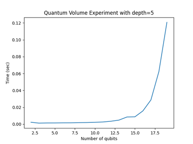
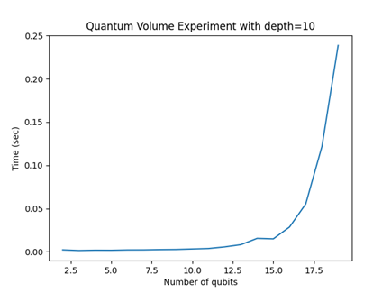
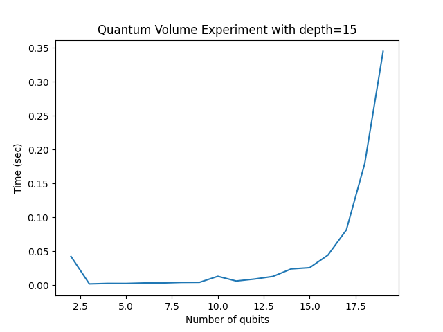

# Tutorial 4 - Micro-benchmark and Visualization

## Table of Content

1. [Application Benchmarking](#application-benchmarking-introduction)
2. [Quantum Benchmark - Reading](#qiskit-quantum-volume)
3. [Running micro-benchmark](#running-qiskit-quantum-volume-benchmark)
4. [Visualising Result](#visualising-qv-result)
5. [Submission](#working-qv-benchmark)


## Application Benchmarking Introduction

In the previous tutorial, [Tutorial 3](../tutorial3/README.md), we learnt about **Synthetic benchmarks**. Now we will learn about **Application benchmarks**. HPC applications are widely used in scientific research and systems evaluation or benchmarking to address complex computational problems. These applications span various fields, including computational chemistry, computational fluid dynamics, cosmology / astrophysics, quantum mechanics, weather forecasting, genomics, to name a few...

These applications are integral to advancing scientific research, enabling researchers to solve complex problems that are otherwise computationally prohibitive. They are also essential for evaluating and benchmarking the performance of high-performance computing systems, ensuring that they meet the demands of cutting-edge research and industrial applications.

## Qiskit

IBM's Qiskit is an open-source [Software Development Kit (SDK)](https://www.ibm.com/quantum/qiskit) for working with quantum computers at the level of circuits, pulses, and algorithms. It provides tools for creating and manipulating quantum programs and running them on prototype quantum devices on IBM Quantum Platform or on simulators on a local computer.

[Qiskit-Aer](https://github.com/Qiskit/) is an extension to the Qiskit SDK for using high performance computing resources to simulate quantum computers and programs. It provides interfaces to run quantum circuits with or without noise using a number of various simulation methods. *Qiskit-Aer* supports leveraging *MPI* to improve the performance of simulation.


> [!CAUTION]
> 
> This section aims to test your understanding of what you have learn so far. The python code below **will give an error** when you try to run it :grimacing: .
> You will have to **debug** it to successfully meet the deliverables. Carefully read the error message as it may print out useful information such as a missing packages or the line where the error occurs.


## Running Qiskit Quantum Volume benchmark

**Quantum Volume (QV)** is a single-number metric that can be measured using a concrete protocol on near-term quantum computers of modest size. The QV method quantifies the largest random circuit of equal width and depth that the computer successfully implements. Quantum computing systems with high-fidelity operations, high connectivity, large calibrated gate sets, and circuit rewriting tool chains are expected to have higher quantum volumes. Simply put, Quantum Volume is a single number meant to encapsulate the performance of today’s quantum computers, like a classical computer’s transistor count.

0. This first step has already been done for you however, you would normally start by configuring and install dependencies. <br>You will be using [Python Pip - PyPI](https://pypi.org/project/pip/) to configure and install Qiskit. `pip` is the official tool for installing and using Python packages from various indexes.

1. Create and Activate a New Virtual Environment.<br>
    Separate your python projects and ensure that they exist in their own, clean environments:

   ```bash
   python -m venv QiskitAer
   source QiskitAer/bin/activate
   ```

2. Install `qiskit-aer`.<br>
   ```bash
   pip install qiskit-aer
   
   # Create benchmark python file
   touch qv_experiment.py
   ```

3. Save the following in a Python script `qv_experiment.py`:<br>
   ```python
   from qiskit import *
   from qiskit.circuit.library import *
   from qiskit_aer import *
   import time
   import numpy as np

   def quant_vol(qubits=15, depth=10):
      sim = AerSimulator(method='statevector', device='CPU')
      circuit = QuantumVolume(qubits, depth, seed=0)
      circuit.measure_all()
      circuit = transpile(circuit, sim)

      start = time.time()
      result = sim.run(circuit, shots=1, seed_simulator=12345).result()
      time_val = time.time() - start
      return time_val


   num_qubits = np.arange(2, 10)
   qv_depth = 5
   num_shots = 10

   # Array for storing the output results
   results_array = []

   # iterate over qv depth and number of qubits
   for i in num_qubits:
      results_array[i] = quant_vol(qubits=i, shots=num_shots, depth=qv_depth)
      # for debugging purposes you can print out the results
   ```

> [!TIP]
> 
> Printing out results will help you know if you have run the benchmark successfully.

4. Parameterize the following variables for the QV experiment.<br>
   These are used to generate the QV circuits and run them on a backend and on an ideal simulator:
   * `qubits`: number or list of physical qubits to be simulated for the experiment.
   * `depth`: meaning the number of discrete time steps during which the circuit can run gates before the qubits decohere.
   * `shots`: used for sampling statistics, number of repetitions of each circuit. A larger number of shots will be more demanding on the system.

5. Run the benchmark by executing the script you've just written.<br>
   ```bash
   python qv_experiment.py
   ```

## Visualising QV Result

Congratulations :partying_face: if you where able to solve the above problems. We managed to get a set of results, but what does that it mean? How can we better understand our data? The answer is *visulaising*.

As humans we find charts, graphs and illustrations much easier to understand. Because these graphics aid understanding we will be taking out result from above and visualising it using Jupyterlab.

<details>

<summary>Configuring and Connecting to your Remote JupyterLab Server</summary><br>

[Project Jupyter](https://jupyter.org/) provides powerful tools for scientific investigations due to their interactive and flexible nature. Here are some key reasons why they are favoured in scientific research.

* **Interactive Computing and Immediate Feedback**<br>
  Run code snippets and see the results immediately, which helps in quick iterations and testing of hypotheses.  Directly plot graphs and visualize data within the notebook, which is crucial for data analysis.

* **Documentation and Rich Narrative Text**<br>
  Combine code with Markdown text to explain the methodology, document findings, and write detailed notes. Embed images, videos, and LaTeX equations to enhance documentation and understanding.

* **Reproducibility**<br>
  Share notebooks with others to ensure that they can reproduce the results by running the same code. Use tools like Git to version control the notebooks, ensuring a record of changes and collaborative development.

* **Data Analysis and Visualization**<br>
  Utilize a wide range of Python libraries such as NumPy, Pandas, Matplotlib, and Seaborn for data manipulation and visualization. Perform exploratory data analysis (EDA) seamlessly with powerful plotting libraries.

Jupyter Notebooks provide a versatile and powerful environment for conducting scientific investigations, facilitating both the analysis and the clear communication of results.<br>
</details>

1. Create and Activate a New Python Virtual Environment.

2. Install Project Jupyter and [Plotly](https://plotly.com/python/ipython-notebook-tutorial/) plotting utilities and dependencies.

   ```bash
   pip install jupyterlab ipywidgets plotly jupyter-dash
   ```

3. Start the JupyterLab server.<br>
   ```bash
   jupyter lab --ip 0.0.0.0 --port 8889 --no-browser
   ```

   * `--ip` binds to all interfaces on your head node, including the public facing address
   * `--port` bind to the port that you granted access to in `nftables`
   * --no-browser, do not try to launch a browser directly on your head node.

> [!NOTE]
> 
> An resulting error are not due to the firewall as TCP port 8889 is already open on the nftables(the firewall).

4. Carefully copy your `<TOKEN>` from the command line after successfully launching your JupyterLab server.

   ```bash
   # Look for a line similar to the one below, and carefully copy your <TOKEN>
   http://127.0.0.1:8889/lab?token=<TOKEN>
   ```

5. Open a browser on you workstation and navigate to your JupyterLab server on your headnode:

   ```bash
   http://<headnode_public_ip>:8889
   ```
6. Login to your JupyterLab server using your `<TOKEN>` and Create a new terminal session.<br>
    Notice that the terminal session is still within your Qiskit-Aer environment.

7. Using jupyterLab terminal, append the following to your `qv_experiment.py` script:

   ```python
   # Fill in the missing package and library
   import <package.library> as plt

   plt.xlabel('Number of qubits')
   plt.ylabel('Time (sec)')
   plt.plot(num_qubits, results_array)
   plt.title('Quantum Volume Experiment with depth=' + str(qv_depth))
   plt.savefig('qv_experiment.png')
   ```
8. From JupyterLab terminal, run the benchmark by executing the script you've just modified.


## Working QV Benchmark

You will encounter most of the expected tasks while you work through the tutorial. Below you will paste all requested screenshots and deliverables mentioned.

By completing the first successful run and visualisation of the Quantum Volume micro-benchmark, the python code in `qv_experiment.py` script is as follows:<br>
```python
# Paste you code here for marks
```

When the above code is run and visualised in JupyterLab, the image below is generated,<br>
 
> Add image for of initial qv_experiment.py result. When
> `num_qubits=(2,10)`, `qv_depth=5`, `num_shots=10`
> This will also count as proof that you have successfully launched JupyterLab.

We will now consider what affect each parameter has on the outcome.

* ### Varying volume depth

   When `qv_depth` is varied, we see an increase in time per simulation. The `depth` parameter is the number of discrete time steps during which the circuit can run gates before the qubits decohere. Thus the increase or decrease of `qv_depth` will proportionally increase or decrease simulation time.

   | **Case 1** `qv_depth=5` | **Case 2** `qv_depth=10` | **Case 3** `qv_depth=15`  |
   |-------------------------|--------------------------|---------------------------|
   | `num_qubits=(2,20)`<br>`qv_depth=5`<br>`num_shots=10`<br><br>  | `num_qubits=(2,20)`<br>`qv_depth=10`<br>`num_shots=10`<br><br>  | `num_qubits=(2,20)`<br>`qv_depth=15`<br>`num_shots=10`<br><br>  |

   In the table above we see the vertical axis (y-axis) scale increase as `qv_depth` increases.


* ### Varying number of qubits

   Write a section discussing the affect of varying the number of qubits.<br>
   Vary `num_qubits` and see how high you can go. Label visualisation of maximum as `qv_experiment_MAXqubits.png` in the images folder.<br>
   I only expect one image when you have reached the highest number of qubits the system can handle.<br>
   > `qubits`: number or list of physical qubits to be simulated for the experiment.


*  ### Varying number of shots

   Write a section similar to [varying depth](#varying-volume-depth) discussing the affect of varying the number of shots.<br>
   Vary `num_shots`. Minimum of 2 images presented in an easily understandable format like a table or bullet points with discussion blocks.<br>
   >`shots`: used for sampling statistics, number of repetitions of each circuit. A larger number of shots will be more demanding on the system.
